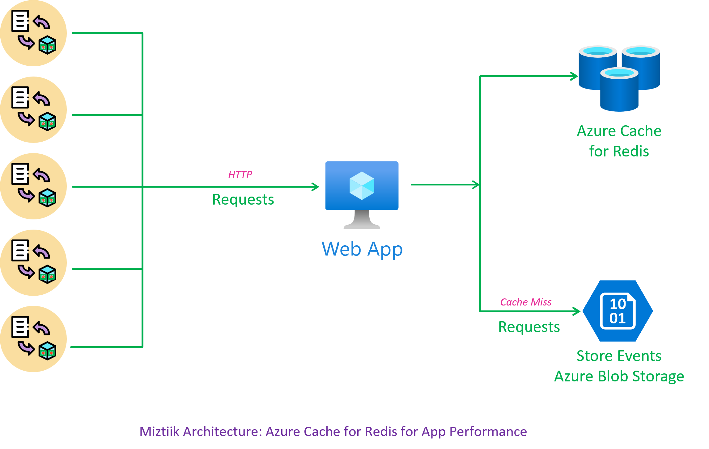
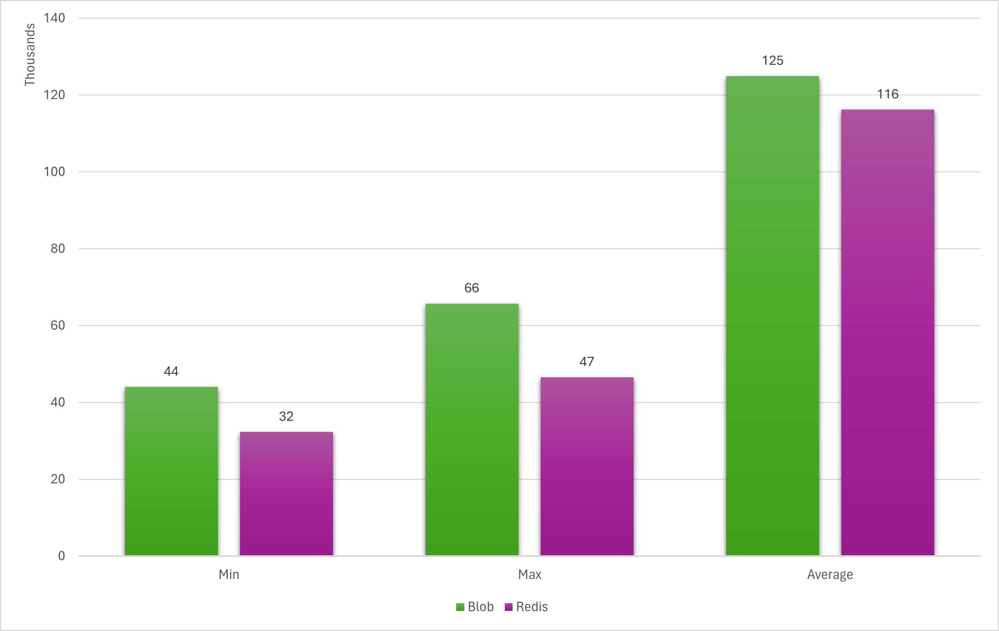

# Use Reds to improve Application Performance

1. Set up a Redis server
1. Setup a client(laptop) or cloud VM will do - Ensure you have python3, redis and redis-py installed. Also have az cli with a valid subscription and permissions to access blob storage.
1. Run `azure_load_data_to_redis_and_blob.py` to load data to redis and blob storage
1. Run `azure_query_redis.py` to query redis,  dont forget to change the connection string etc.,
1. Run `azure_query_blob.py` to query blob storage, dont forget to change the sa, blob name etc.,



## Results

With connection reuse, native blob performance seems to be really good. Ofcourse, this is an scientific test, but a good way to play around with these services.

### Blob Storage Results

```
Average Latency in Microseconds: 72705.66666666667
MAX Latency in Microseconds: 138237
MIN Latency in Microseconds: 46010

Average Latency in Microseconds: 59180.95918367347
MAX Latency in Microseconds: 106380
MIN Latency in Microseconds: 42995

Average Latency in Microseconds: 65292.27272727273
MAX Latency in Microseconds: 130139
MIN Latency in Microseconds: 43072
```

### Redis Results

```
Average Latency in Microseconds: 45723.61224489796
MAX Latency in Microseconds: 132433
MIN Latency in Microseconds: 31924

Average Latency in Microseconds: 54349.26530612245
MAX Latency in Microseconds: 101037
MIN Latency in Microseconds: 34435

Average Latency in Microseconds: 39566.7995991984
MAX Latency in Microseconds: 115064
MIN Latency in Microseconds: 30541
Cache Misses: 253 253/1000

Average Latency in Microseconds: 48433.47695390782
MAX Latency in Microseconds: 497720
MIN Latency in Microseconds: 31514
```



| Result Category | Blob Storage Min | Blob Storage Avg | Blob Storage Max | Redis Min | Redis Avg | Redis Max |
|-----------------|------------------|------------------|------------------|-----------|-----------|-----------|
| 1               | 46,010           | 72,705.67        | 138,237          | 31,924    | 45,723.61 | 132,433   |
| 2               | 42,995           | 59,180.96        | 106,380          | 34,435    | 54,349.27 | 101,037   |
| 3               | 43,072           | 65,292.27        | 130,139          | 30,541    | 39,566.80 | 115,064   |
